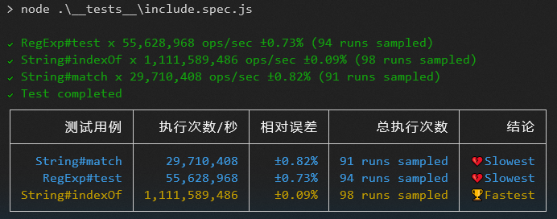

## BenchmarkJavascript

> 使用Benchmarkjs来做代码性能分析。

### feature：

1. 对监听部分做了包装；
2. 对输出部分做了终端表格展示；
3. Case编写提到单独文件编写；

### use：

1. 安装依赖：```npm install```；
2. 运行Test：```npm run test```
3. 输出结果：


### code simple:

```JavaScript
require("../src")
  .cases([
    {
      "RegExp#test": function () {
        /o/.test("Hello World!");
      },
    },
    {
      "String#indexOf": function () {
        "Hello World!".indexOf("o") > -1;
      },
    },
    {
      "String#match": function () {
        !!"Hello World!".match(/o/);
      },
    },
  ])
  .run({ async: true });
```